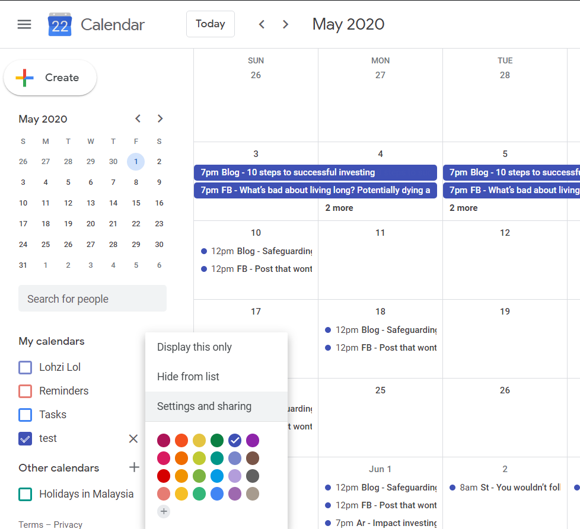

Sync Google Spreadsheet and Google Calendar
===========================================

Last update: 28/4/2020

This script is a [google apps script](https://script.google.com/intro) that automatically synchronize events that you have created in [Google spreadsheet](https://www.google.com/sheets/about/) to your [Google Calendar](https://calendar.google.com/).

Simply follow each of the steps by reading through this guide to fully understand how to setup, how to use and all the script features.

You can get google spreadsheet and calendar sample here:
- [sample spreadsheet](https://docs.google.com/spreadsheets/d/1I6Gf0mKnmVScVR1xUj1imyw_ibZv2iBuf83sb1s6mWo/edit?usp=sharing)
- [sample calendar](https://calendar.google.com/calendar?cid=dHRqNDI1azNiYm8wa3RybnMydHN2cThsbjhAZ3JvdXAuY2FsZW5kYXIuZ29vZ2xlLmNvbQ)

#### Person-in-charge

Loh Zi Jian, lohzi97@gmail.com

### Content

[1 - Setup](#1---setup)

[2 - Link Spreasheet to Calendar](#2---link-spreasheet-to-calendar)

[3 - Using the Script for the First Time](#3---using-the-script-for-the-first-time)
- [3.1. Set the sheet to sync](#31-set-the-sheet-to-sync)
- [3.2. Prepare the header row](#32-prepare-the-header-row)
- [3.3. Follow specific format when filling in information](#33-follow-specific-format-when-filling-in-information)
- [3.4. Using "Sync To", "Sync From", "Clear All" and "Auto Sync"](#34-using-"sync-to"-"sync-from"-"clear-all"-and-"auto-sync")
  - [3.4.1. "Sync To"](#341-"sync-to")
  - [3.4.2. "Sync From"](#342-"sync-from")
  - [3.4.3. "Clear All"](#343-"clear-all")
  - [3.4.4. "Enable Auto Sync" / "Disable Auto Sync"](#344-"enable-auto-sync"-/-"disable-auto-sync")

[4 - Format](#4---format)
- [4.1. Date](#41-date)
- [4.2. Time](#42-time)
- [4.3. Recurrence](#43-recurrence)
  - [4.3.1. Repeat on daily basis](#431-repeat-on-daily-basis)
  - [4.3.2. Repeat on weekly basis](#432-repeat-on-weekly-basis)
  - [4.3.3. Repeat on monthly basis](#433-repeat-on-monthly-basis)
  - [4.3.4. Repeat on yearly basis](#434-repeat-on-yearly-basis)

[5 - Parameter Explanation](#5---parameter-explanation)
- [Table 1: Parameter overview](#table-1-parameter-overview)
- [Table 2: headerObject](#table-2-headerobject)
- [Table 3: syncPeriod](#table-3-syncperiod)

[6 - Script Behaviour](#6---script-behaviour)
- [6.1. Sync To](#61-sync-to)
- [6.2. Sync From](#62-sync-from)

[7 - Reason for required permission](#7---reason-for-required-permission)

[8 - Quota and Limit](#8---quota-and-limit)


---------
1 - Setup
---------

1.  Open your spreadsheet that you want to sync to google calendar.

2.  At the spreadsheet menu bar, expand "Tools" and click on "Script Editor".

    

3.  Copy the code in *script.js* and paste it into the script editor.

    

4.  Save it and enter a project name for it. Project name can be any name that you like.

    

5.  Reopen your spreadsheet. The script editor should be closed automatically. If it does not, just leave it open, we need to edit a few line of codes later.

6.  Now you should see a "Sync Calendar" item appear in your menu. Expand it and click on "Clear All".

    

7.  Google will now ask for your permission to allow this script to run. Allow it. 

    You can choose not to give the permission if you does not trust this script. However, you will not be able to use it. See ["7 - Reason for required permission"](#7---reason-for-required-permission) to know the reason why the script request for those permission.

    

    The account that you choose to sign in MUST be same as the account that your spreadsheet is in and your calendar is in. This means that you must be the owner of the spreadsheet and the calendar to use this script.

    

    

8.  Done setup. :)

-------------------------------
2 - Link Spreasheet to Calendar
-------------------------------

1.  Open the script editor. You should able to see the following code at line 6 to line 38:
    ```javascript
    /**
      * Define parameter.
      * - All these need to be defined by user.
      */
    var spreadSheetURL = "YOUR_SPREADSHEET_URL";
    var calendarID = "YOUR_CALENDAR_ID";
    var headerColor = "#4a86e8";
    var sheetNames = ["Sheet1", "Sheet2"];
    var headerString = [
      {
        'date': "Date",
        'time': "Time",
        'recurrence': "Recurrence",
        'titles': ["Blog Title", "FB Post Title 1"],
        'ids': ['CalendarEventID - Blog', 'CalendarEventID - FB'],
        'prefix': ["Blog", "FB"]
      },
      {
        'date': "D",
        'time': "T",
        'recurrence': "Re",
        'titles': ["Articles", "Stories"],
        'ids': ['CalendarEventID - Arti', 'CalendarEventID - Sto'],
        'prefix': ["Ar", "St"]
      }
    ];
    var noSyncString = "NOSYNC";
    var identificationString = "Calendar Sync";
    var syncPeriod = {
      'yearBefore': 1,
      'yearAfter': 3
    };
    var syncMinutes = 15;
    ```

2.  Replace `YOUR_SPREADSHEET_URL` with the url of your spreadsheet. You can get it by simply copying the url of your spreadsheet in your browser.

    

3.  Replace `YOUR_CALENDAR_ID` with the calendar id that you want the event sync to. You can get it by going to your google calendar. At your left sidebar, you should see a section called "My Calendars". Choose the calendar that you want the spreadsheet event to sync to, and then click on the three dots that is beside the calendar name. A menu will pop up. Click on "Settings and sharing". Scroll down until you see a section called "Integrate calendar". You calendar ID is the first item in that section. An example of the calendar ID: "ttj425f3bbo1ktrns2tsvq8ln8@group.calendar.google.com"

    

    

4.  Save the script. Done. :)

---------------------------------------
3 - Using the Script for the First Time
---------------------------------------

To use the script, you will need to modify the code at line 6 to line 38 (as shown below). 
```javascript
/**
 * Define parameter.
 * - All these need to be defined by user.
 */
var spreadSheetURL = "https://docs.google.com/spreadsheets/d/1XdYDfoyke-NvJOv9T_4iK6hq3pWtUu74-Sl5WJ7dHZs/edit#gid=0";
var calendarID = "ttj425k3bbo0ktrns2tsvq8ln8@group.calendar.google.com";
var headerColor = "#4a86e8";
var sheetNames = ["Sheet1", "Sheet2"];
var headerString = [
  {
    'date': "Date",
    'time': "Time",
    'recurrence': "Recurrence",
    'titles': ["Blog Title", "FB Post Title 1"],
    'ids': ['CalendarEventID - Blog', 'CalendarEventID - FB'],
    'prefix': ["Blog", "FB"]
  },
  {
    'date': "D",
    'time': "T",
    'recurrence': "Re",
    'titles': ["Articles", "Stories"],
    'ids': ['CalendarEventID - Arti', 'CalendarEventID - Sto'],
    'prefix': ["Ar", "St"]
  }
];
var noSyncString = "NOSYNC";
var syncPeriod = {
  'yearBefore': 1,
  'yearAfter': 3
};
var syncMinutes = 15;
var identificationString = "Calendar Sync";
```

PLEASE DO NOT MODIFY ANY OTHER PART OF THE SCRIPT, UNLESS YOU KNOW WHAT YOU ARE DOING. If you have found bugs in the code or you want to add more feature or modify the script behaviour, please inform the [person-in-charge](#person-in-charge), so that everyone are able to use the same script. 

### 3.1. Set the sheet to sync

There can be multiple sheet within a spreadsheet. You need to define the sheet that contain the events that you want to sync. You can have more than 1 sheet that need to be sync. However, keep in mind that all these event will be sync to the same calendar. 

To define the to-be-sync sheet, change the code in line 13:
```javascript
var sheetNames = ["Sheet1", "Sheet2"];
```

For example, if i have a sheet named as "Scheduled Class" and i want to sync all the scheduled class as event into my calendar. I will change line 13 to:
```javascript
var sheetNames = ["Scheduled Class"];
```

If i have 3 sheet that i want to sync and they are named as "Family Activities" "Work Activities" "Personal Activities" respectively, I will change line 13 to:
```javascript
var sheetNames = ["Family Activities", "Work Activities", "Personal Activities"];
```

### 3.2. Prepare the header row

1.  Define the header row's background color.

    In order for the script to know where are all the required information to create event in Google Calendar (such as event title, date, time, etc.), your sheet should have a header row, which is defined by a specific background color. The script will scan the sheet row by row, from the first row to the last row, and then take the first encounter row with the defined background color as the header row. 

    To define the background color for the header row, refer to line 12 in the script:
    ```javascript
    var headerColor = "#4a86e8";
    ```
    The `#4a86e8` is the hex color code for the header color. You can get the hex color code in the "fill color" tool, then click on the "+" button to add custom color. From there you can choose any color and the hex code for that color will be given there.

    

    Fill the header row with the color that you have chosen, and then replace the `#4a86e8` in the script's line 12 to your hex color code. For example, let say I want to set red color `#ff0000` as my header color, i will change the line 12 to:
    ```javascript
    var headerColor = "#ff0000";
    ```

2.  Define the required column name.

    - One event per row, using one sheet.
    
      To create an event in Google Calendar, you will need to provide the event's title, starting and ending date, and start and ending time. All these must be put into the column, which the column header row have the header name that you have set in line 14 to line 30 (variable `headerString`). 

      The script will look at the header row and search for the defined name column by column, and then it will use that column to fill in the required event information. 

      Let use an example for better explaination. Say, i have one sheet that need to be sync, and in that sheet i have a header row looks like this:

      

      So i should set the `headerString` variable as such:
      ```javascript
      var headerString = [
        {
          'date': "DATE",
          'time': "TIME",
          'recurrence': "RECURRENCE",
          'titles': ["ACTIVITY"],
          'ids': ["EVENT ID"],
          'prefix': ["Activity"]
        }
      ];
      ``` 
      The `'date': "DATE"` tell the script that column A contain the event's date information. The `'time': "TIME"` tell the script that column B contain the event's time information. The `'titles': ["ACTIVITY"]` tell the script that column E contain the event's title information. And so on. 

      `'recurrence': "RECURRENCE"` is a column that use to set the recurrence setting of the event. For example, you can set the event to repeat every 3 days and then end after repeating 3 times by using "Re:every3Day EndAfter:3times". For more information on how to set recurrence event, see ["4.3. Recurrence"](#43-recurrence).

      As for `ids: ["EVENT ID"]`, this is a column that the script will fill in the event's unique id after you have sync it with your calendar. YOU SHOULD LEAVE THE WHOLE COLUMN BLANK AND NOT MESS WITH THE VALUE IN IT. This is because the script uses this event id to link the google calendar event with the event that you have written in your spreadsheet. Changing the value or deleting the value will cause the script to recreate a new event in your calendar and result in duplicated events. Don't worry, the script has set the "ids column" to be warning protected. So you will be warned if you tried to change the value or delete it. However, if you want to delete the event, you can just ignore the warning and delete the whole row. Just keep in mind that you should not change the "ids column" yourself.

      The `'prefix': ["Activity"]` is prefix that will be added in front of your titles when the script create the event. Refering back to the above image's row 3, the title of the activity is "Post on facebook business page", hence the script will create an event named as "Acticity - Post on facebook business page" in your calendar. Prefix can be anything that you like, but they should not be similar.

    - Multiple events per row, using one sheet.

      If you know about programming, you should have notice that the `'titles'`, `'ids'` and `'prefix'` are defined in the form of array. This means that you can defined multiple `'titles'`, `'ids'` and `'prefix'` in your header row.

      Consider the following header row:

      

      I will set the `headerString` as such:
      ```javascript
      var headerString = [
        {
          'date': "DATE",
          'time': "TIME",
          'recurrence': "RECURRENCE",
          'titles': ["ACTIVITY 1", "ACTIVITY 2"],
          'ids': ["ACTIVITY 1 ID", "ACTIVITY 2 ID"],
          'prefix': ["A1", "A2"]
        }
      ];
      ```

      With this headerString, the script now know that "ACTIVITY 1" (column E) and "ACTIVITY 2" (column G) are both event's title, whereas "ACTIVITY 1 ID" (column I) and "ACTIVITY 2 ID" (column J) are both columns that the script will fill in the event ID. So the script will create 2 events with the same date, time and recurrence information. Using the above image's row 3 as an example, the script will create one event named "A1 - Post on facebook business page" and another event named "A2 - Write blog post", both at 21/4/2020 1900.

    - Using multiple sheet

      The `headerString` variable is also an array! This is used to define the required column name in multiple sheet. If you are using multiple  sheet, the number of element in `headerString` must be same as the number of element in `sheetNames`. The first object in the `headerString` array defines the required column names for the first sheet in `sheetNames`, second object in `headerString` array defines the required column names for the second sheet in `sheetNames`, and so on. 

      Let say now i have the following headers at sheet "Marketing&Sales" and sheet "Operation":

      

      Following instruction at section ["3.1. - Set the sheet to sync"](#31-set-the-sheet-to-sync), i should set the `sheetNames` to:
      ```javascript
      var sheetNames = ["Marketing&Sales", "Operation"];
      ```

      Since now i have 2 item in the `sheetNames` array, i will need to define 2 object in `headerString`:
      ```javascript
      var headerString = [
        {
          'date': "DATE",
          'time': "TIME",
          'recurrence': "RECURRENCE",
          'titles': ["ACTIVITY 1", "ACTIVITY 2"],
          'ids': ["ACTIVITY 1 ID", "ACTIVITY 2 ID"],
          'prefix': ["S&M 1", "S&M 1"]
        },
        {
          'date': "D",
          'time': "T",
          'recurrence': "R",
          'titles': ["ACTIVITY"],
          'ids': ["EVENT ID"],
          'prefix': ["OP"]
        }
      ];
      ```
      Notice that you can set a completely different name for all those required column name. 

### 3.3. Follow specific format when filling in information

It is important to follow certain format when you are using the script. For example, date should be given in YYYYMMDD format and time should be given in 24 Hour format. You should refer to section ["4 - Format"](#4---format) for detailed format explanation. The script will not be able to capture your event's information if you do not follow the specified format. 

One special format that can be set is the `noSyncString` variable. It allow you to deselect certain event in your spreadsheet to not sync to your calendar. All you need to do is include the defined `noSyncString` in front of the event's title. For example, in line 32, we have:
```javascript
var noSyncString = "NOSYNC";
```

Events title that begin with `NOSYNC` word will be ignored by the script. Just like the below image, in row 5, the activity 1, "Be familiar with live streaming software" event will not be created or updated by the script. However, the "Guide peter to use live streaming software" event that is also in row 5, will still be created even though they both are at row 5. 


By change the `noSyncString`, you can change the word to exclude sync to any word you like. Say if i change it to:
```javascript
var noSyncString = "xSYNC";
```

The "follow up with Hanz" event in row 6 will not be sync, but the "Be familiar with live streaming software" event will now be sync. 

### 3.4. Using "Sync To", "Sync From", "Clear All" and "Auto Sync". 

#### 3.4.1. "Sync To"

When you are ready to sync to spreadsheet to you calendar, simply click on this "sync to" button. The script will sync your spreadsheet to your calendar. 

Saying so, the script will only sync event that are within a certain timeframe. This sync timeframe is defined in line 33 to line 36:
```javascript
var syncPeriod = {
  'yearBefore': 1,
  'yearAfter': 3
};
```
The above settings means that the script will only sync events that is 1 year before today and 3 years after today. Let say today is 26/4/2020, the script will only sync events that are within 26/4/2019 and 26/4/2023. Any event that is outside of this timeframe will not be sync. Of course, you can set this to an arbitrary large value, such as `'yearBefore': 9999` and `'yearAfter': 9999`. But the downside of this is that, if you have a lot of event that need to be sync (maybe 1000+?), then the script might need more time to run. And then if it exceed the [script runtime limits](#8---quota-and-limit), the script will be stopped forcefully by google thus messing up all your events.

Last thing to point out is that it is important to understand how this "sync to" feature works, so that you know what you to expect when you sync your spreadsheet. Please see section ["Sync To Behaviour"](#61-sync-to) to understand the sync to behaviour of the script. 

#### 3.4.2. "Sync From"

After you have sync your spreadsheet to your calendar, you can pull the calender events back to your spreadsheet. This act as a backup feature for your spreadsheet. You can easily pull back the date, time, recurrence and title(s) information back to your spreadsheet if you messed up with it. It can only pull events that is created by the script itself. If you manually created an event in your calendar and hopes the script pull it into your spreadsheet, sorry, this will not work. 

Another way to use this "Sync From" feature is after you have modified your calendar, and you want those changes in calendar to reflect on your spreadsheet. "Sync From" will automatically pull your changes in calendar into your spreadsheet. However, keep in mind that if you have enabled the auto sync feature, the modification that you have done in your calendar might be overwritten by event setting in spreadsheet when the script sync your spreadsheet to your calendar. You need to manually click on the "Sync From" button in your spreadsheet before the script tries to sync your spreadhseet to your calendar. 

#### 3.4.3. "Clear All"

"Clear All" is basically a reset button. It deletes all the events created by the script in your calendar and clear the whole Event ID column(s) in your spreadsheet. It is most useful when the script has weird behaviour and has messed up your calendar. Simply clear all of the events and then resync it with "Sync To". 

You may need to click on this "Clear All" a few times if your calendar consist of duplicated events created by the script. This is because the script will only capture 1 event if there are multiple events of the same name.

#### 3.4.4. "Enable Auto Sync" / "Disable Auto Sync"

By default, the auto sync feature is disbaled, so before enabling auto sync feature, you should see the "Enable Auto Sync" button. After you have enabled auto sync feature, you should see the "disable auto sync" button. 

You can set the time interval between each auto sync at line 37:
```javascript
var syncMinutes = 15;
```

The above line of code set the sync interval to be 15 minutes. This means that the script will sync your spreadsheet to your calendar once every 15 minutes. The `syncMinutes` value is limited to be only either `1`, `5`, `10`, `15` or `30`. The sync feature will not work if it is not one of these value. 

----------
4 - Format
----------

### 4.1. Date

Use YYYYMMDD format. This format only specify start date. The script will view the event as a one day event. 

Use YYYYMMDD-YYYYMMDD format. This format contain start date and end date. The YYYYMMDD to the left of the hypen is the start date and the other is end date.

### 4.2. Time

Use HHMM format (24 hour format). This format only specify start time. The script will automatically add 1 hour after the start time as the end time.

Use HHMM-HHMM format. This format contain start time and end time. The HHMM to the left ofRe:every3Day EndOn:20200414the hypen is the start time and the other is end time.

*Tips to use spreadsheet: to enter zero at the begining of time, you need to include a single quote. E.g.: to enter 0800, you should type in '0800, or else spreadsheet will automatically change it to 800.*

### 4.3. Recurrence

Here i will use example to illustrate the format of recurrence.

#### 4.3.1. Repeat on daily basis

- Example 1: `Re:every3Day`

  This read as "repeat every 3 days". This format does not define when the recurrence event will end, so it will repeat indefinitely. You can change the `"3"` to any number.

- Example 2: `Re:every4Day EndOn:20200414`

  This read as "repeat every 4 days, end on 14/4/2020". This means that the recurrence event will keep on repeat, until 14/2/2020. You can change the `"4"` to any number, and the `20200414` to any date. Date follows the [YYYYMMDD format mentioned in section 4.1](#41-date).

- Example 3: `Re:every1Day EndAfter:10times`

  This read as "repeat every 1 day, end after it repeats 10 times". This means that the recurrence event will only repeat for 10 times. You can change the `"1"` and `"10"` to any number.

#### 4.3.2. Repeat on weekly basis

- Example 1: `Re:every1Week On:[Mon,Tues,Wed]`

  This read as "repeat every 1 week, on Monday, Tuesday and Wednesday" (in other words, it repeats every week). This format does not define when the recurrence event will end, so it repeat indefinitely. You can change the `"1"` to any number, and the `Mon,Tues,Wed` to any combination of `Mon,Tues,Wed,Thurs,Fri,Sat,Sun`.

- Example 2: `Re:every2Week On:[Mon,Wed,Fri] EndOn:20200414`

  This read as "repeat every 2 weeks, on Monday, Wednesday and Friday, and end on 14/4/2020". This means that the recurrence event will keep on repeat every every 2 weeks, on Monday, Wednesday and Friday, until 14/2/2020. You can change the `"2"` to any number, the `Mon,Tues,Wed` to any combination of `Mon,Tues,Wed,Thurs,Fri,Sat,Sun`. and the `20200414` to any date. Date follows the [YYYYMMDD format mentioned in section 4.1](#41-date).

- Example 3: `Re:every3Week On:[Sat,Sun] EndAfter:5times`

  This read as "repeat every 3 weeks, on Saturday and Sunday, and end after it repeats 5 times". This means that the recurrence event will only repeat for 5 times. You can change the `"1"`and `"5"` to any number, and the `Mon,Tues,Wed` to any combination of `Mon,Tues,Wed,Thurs,Fri,Sat,Sun`.

#### 4.3.3. Repeat on monthly basis

- Example 1: `Re:every2Month With:Date`

  This read as "repeat every 2 months, and it should repeat at the similar date". For example, if the first event that i set is at 4/2/2020, then the next occurence of the event will at 4/4/2020. This format does not define when the recurrence event will end, so it repeats indefinitely. You can change the `"2"` to any number, and the `Date` to only `Date` or `Week`. See example 3 on how `Week` works. 

- Example 2: `Re:every2Month With:Date EndOn:20200414`

  This read as "repeat every 2 month, it should repeat at the similar date, and end on 14/4/2020". For example, if the first event that i set is at 4/2/2020, then the next and last occurence of the event will at 4/4/2020. You can change the `"2"` to any number, the `Date` to only `Date` or `Week` (See example 3 on how `Week` works), and the `20200414` to any date. Date follows the [YYYYMMDD format mentioned in section 4.1](#41-date).

- Example 3: `Re:every3Month With:Week EndAfter:5times`

  This read as "repeat every 3 months, it should repeat at the similar day of week, and end afte it repeats 5 times". For example, if the first event that i set is at 4/2/2020, which is the first tuesday of the month, then the next occurence of the event will at 5/5/2020, which is also the first tuesday of the month. You can change the `"3"` and `"5"` to any number, the `Date` to only `Date` or `Week` (See example 1 on how `Date` works).

#### 4.3.4. Repeat on yearly basis

- Example 1: `Re:every1Year`

  This read as "repeat every 1 year". This format does not define when the recurrence event will end, so it will repeat indefinitely. You can change the `"1"` to any number.

- Example 2: `Re:every1Year EndOn:20250414`

  This read as "repeat every 1 year, end on 14/4/2025". This means that the recurrence event will keep on repeat, until 14/2/2025. You can change the `"1"` to any number, and the `20250414` to any date. Date follows the [YYYYMMDD format mentioned in section 4.1](#41-date).

- Example 3: `Re:every2Year EndAfter:3times`

  This read as "repeat every 2 year, end after it repeats 3 times". This means that the recurrence event will only repeat for 3 times. You can change the `"2"` and `"3"` to any number.

-------------------------
5 - Parameter Explanation
-------------------------

### Table 1: Parameter overview
| Parameter              | Type   | Description |
|------------------------|--------|-------------|
| `spreadSheetURL`       | string | The URL that link to your spreadsheet. |
| `calendarID`           | string | The Calendar ID of your calendar. See ["2 - Link Spreasheet to Calendar"](#2-link-spreasheet-to-calendar) for instruction to get your calendar ID.|
| `headerColor`          | string | The hex code background color of the header row. |
| `sheetNames`           | Array  | An array of string. Each string is one of the sheet's name that contain the events information that you want to sync to. Must have same length as `headerString`. See ["3.1. Set the sheet to sync"](#31-set-the-sheet-to-sync) for more example of using it. |
| `headerString`         | Array  | An array of `headerObject` (see [Table 2: headerObject](#table-2-headerobject)). Use to define the required column name in header row. Must have same length as `sheetNames`. |
| `noSyncString`         | string | A word that you can place in front of your event title to tell the script not to sync this event. |
| `syncPeriod`           | object | An object that use to define the period to sync, in years. Events that lies outside of this period will not be sync (see [Table 3: syncPeriod](#table-3-syncperiod)). | 
| `syncMinutes`          | number | The interval of auto sync in minutes. Can only be `1`, `5`, `10`, `15` or `30`.
| `identificationString` | string | A word/phrase that the script uses to differentiate between event created by the script and event not created by the script. It will be written in the event description. |

### Table 2: headerObject

| Field      | Type   | Description |
|------------|--------|-------------|
| date       | string | The name of the column that holds date information. |
| time       | string | The name of the column that holds time information. |
| recurrence | string | The name of the column that holds recurrence information. |
| titles     | array  | An array of string. Each string is one of the name of the column that holds the titles information. Must have same length as `ids` and `prefix`. |
| ids        | array  | An array of string. Each string is one of the name of the column that the script will write the event unique ID to. Must have same length as `titles` and `prefix`. |
| prefix     | array  | An array of string. Each string represent the prefix that will be added infront of the created event title. Must have same length as `titles` and `ids`.  |

See ["3.2. Prepare the header row"](#32-prepare-the-header-row), point 2, for example of using `headerString`.

### Table 3: syncPeriod

| Field      | Type   | Description |
|------------|--------|-------------|
| yearBefore | number | The number of years before today. |
| yearAfter  | number | The number of years after today. |

See ["3.4.1. "Sync To""](#341-sync-to) for example and more explanation of using `syncPeriod`.

--------------------
6 - Script Behaviour
--------------------

### 6.1. Sync To

When you click on the "Sync To" button, here is what the script will do:

1.  The script will first scan through your whole spreadsheet row by row to find all the events in your spreadsheet. It will skip rows that does not have date, time and at least one title. It will also skip the row if the row's date is outside of the defined `syncPeriod`. Events title that is marked with `noSyncString` will also be skipped.

2.  Then the script will scan through your calendar to find all the events that are created by the script and are within `syncPeriod`. 

3.  The script compare the events that it get from your spreadsheet and your calendar, and perform the following logic action:

    - If the event in spreadsheet does not have an event ID, this means that the event in spreadsheet have not been sync to the calendar before.The script will create the event at your calendar. 

    - If the event in spreadsheet have an event ID but is not found in your calendar, this means that you have manually deleted the event in your calendar. The script will mark the event in your spreadsheet with `noSyncString` and remove the event ID.

    - If the event in spreadsheet have an event ID and is found in your calendar, this means that this is one of the event that the script is tracking. The script will compare the event's information, and update the event if the event in your calendar is different to what you have provided in your spreadsheet. 

    - If the event is not in your spreadsheet but is in your calendar, this means that you have removed the event in your spreadsheet. The script will delete the event in your calendar.

4.  After finishing updating the events in your calendar, the script will then write in new event ID, replace an event ID, or delete the event ID in your sheet's Event ID column. 

5.  Finally, the script will set the whole event ID column as warning protected, which means that it will shows a warning if someone try to change the event ID generated by the script.

### 6.2. Sync From

When you click on the "Sync From" button, here is what the script will do:

1.  The script will first scan through your whole spreadsheet row by row to find all the events in your spreadsheet. It will skip rows that does not have date, time and at least one title. It will also skip the row if the row's date is outside of the defined `syncPeriod`. Events title that is marked with `noSyncString` will also be skipped.

2.  Then the script will scan through your calendar to find all the events that are created by the script and are within `syncPeriod`. 

3.  The script compare the events that it get from your spreadsheet and your calendar, and perform the following logic action:

    - If the event in calendar is not found in your spreadsheet via comparing event ID, this means that you have removed the event from your spreadsheet. The script will make a new row and put in the event's date, time, recurrence and title. 

    - If the event in calendar is found in you spreadsheet via comparing event ID, this means that this is one of the event that the script is tracking. The script will compare the event's information, and update the event if the event in your spreasheet is different to the event in your calendar.

    - If the event is not in your calendar but is in your spreadsheet, this means that the spreasheet event have not been sync to your calendar. The script will mark it with `noSyncString` in your spreadsheet.

4.  Finally, the script will set the whole event ID column as warning protected, which means that it will shows a warning if someone try to change the event ID generated by the script.

----------------------------------
7 - Reason for required permission
----------------------------------


The above image shows permission that you need to give to the script and here is explaination on why the script need such premission.

1.  See, edit, create and delete your spreadsheets in Google Drive. 

    The script needs to scan through the particular spreadsheet that you have set in order to know the events that you want to sync to calendar. Also, it need to write the unique Event ID into the spreadsheet to keep track of the synced events. Although it will not create and delete any of your spreadsheet, you still need to grant it this permission because google does not separate see, edit, create and delete into a different permission. 

2.  See, edit, share and permanently delete all the calendar you can access using Google Calendar.

    The script needs to edit the particular calendar that you have set in order to create events that you have written in your spreadsheet. It also need to be able to see the calendar to keep track of the event that the script has created. As for delete, it will not delete a calendar, but it needs to have the ability to delete the events that you have removed in your spreadsheet in the calendar.

3.  Allow this application to run when you are not present.

    The script have auto sync feature, which can automatically sync your spreadsheet to your calendar at a predefined time period, say 15 minutes. This remove the hussle to always click on "Sync To" button everytime you modify your spreadsheet. You can simply close your spreadsheet after editing it and the auto sync feature will update your calendar every 15 minutes for you. 

4.  Display and run third-party web content in prompts and sidebars inside google application.

    The script will show simple prompt to let you know that "sync has completed". It will also shows you prompt to warn you if the script is going to modify your spreadsheet.

-------------------
8 - Quota and Limit
-------------------

Please refer to [Quotas for Google Services](https://developers.google.com/apps-script/guides/services/quotas) for the latest quotas that google provide. The following table might be outdated.

| Feature                 | Consumer (e.g. gmail.com)   | G Suite Basic / Gov         | G Suite Business / Enterprise / Education |
|-------------------------|-----------------------------|-----------------------------|-------------------------------------------|
| Calendar Event Created  | 5000 / day                  | 10000 / day                 | 10000 / day                               |
| Script runtime          | 6 min / execution           | 6 min / execution           | 30 min / execution                        |
